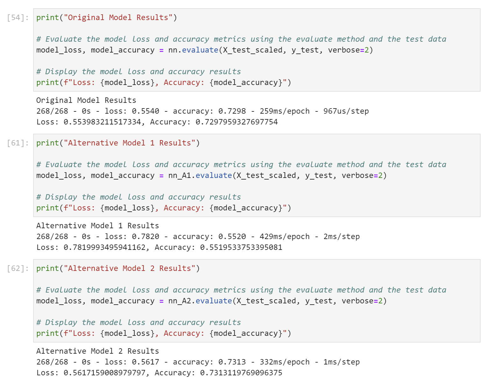

# Venture Funding with Neural Networks

You work as a risk management associate at Alphabet Soup, a venture capital firm. Alphabet Soup’s business team receives many funding applications from startups every day. This team has asked you to help them create a model that predicts whether applicants will be successful if funded by Alphabet Soup.

The business team has given you a CSV file containing more than 34,000 organizations that have received funding from Alphabet Soup over the years. The CSV file contains a variety of information about each business, including whether or not it ultimately became successful. With your knowledge of machine learning and neural networks, you decide to use the features in the provided dataset to create a binary classifier model that will predict whether an applicant will become a successful business.

To predict whether Alphabet Soup funding applicants will be successful, you will create a binary classification model using a deep neural network.

This challenge consists of three technical deliverables. You will do the following:

- Preprocess data for a neural network model.

- Use the model-fit-predict pattern to compile and evaluate a binary classification model.

- Optimize the model.

## Technologies

Programming Languages: Python 3.7.13

Interactive Development Environment: JupyterLab 

Libraries: 
- Pandas - a Python library that is used for data manipulation, analysis, and visualization. 
- Keras - a high-level neural networks API that runs on top of TensorFlow which provides a user-friendly and intuitive interface for building and training deep learning models.
- TensorFlow - an open-source machine learning framework developed by Google that provides a comprehensive ecosystem of tools, libraries, and resources for building and deploying machine learning models. 
- Sklearn - also known as Scikit-learn, which is a popular machine learning library in Python that provides a wide range of tools and algorithms for machine learning tasks such as classification, regression, clustering, and dimensionality reduction.

Operating System(s):  Any operating system that supports Python, including Windows & macOS.

## Installation Guide

To run this analysis, make sure you install the necessary dependencies:

1. Install Python: https://www.python.org/downloads/
2. Install and run Jupyter Lab:  https://jupyter.org/install
3. Clone the repository: git clone "https://github.com/mikenguyenx/13_ml_neural_networks.git" using git or download the ZIP file and extract it to a local directory.

## Usage

To run the script:

1. Open a terminal or command prompt and navigate to the directory with the analysis.
2. Open `venture_funding_with_deep_learning.ipynb` in Jupyter Lab.
3. Run the code cells by clicking on the run button or by pressing the `Shift + Enter` key combination to load and preprocess the data, and generate and optimize machine learning model.

## Instructions

The steps for this challenge are broken out into the following sections:

- Prepare the data for use on a neural network model.

- Compile and evaluate a binary classification model using a neural network.

- Optimize the neural network model.

## Deep Learning Neural Networks 

### Model Results

## Contributors

Mike Nguyen

## License

MIT